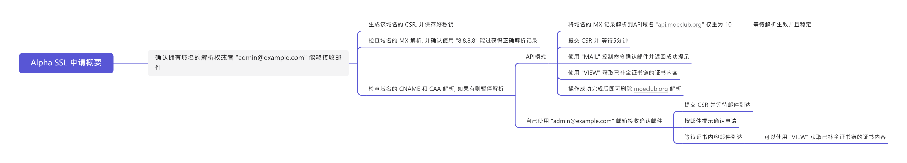

# Alpha SSL 申请教程 [[请前往申请](https://api.moeclub.org/SSL)]

## Alpha SSL 证书申请流程概要
```text

          确认拥有域名的解析权或者 "admin@example.com" 能够接收邮件
                           |
                           V
                 生成该域名的 CSR, 并保存好私钥
                           |
                           V
          检查域名的 MX 解析, 并确认使用 "8.8.8.8" 能过获得正确解析记录
          检查域名的 CNAME 和 CAA 解析, 如果有则暂停解析
                      /             \
                     /               \
                    /                 \
          API模式  /                   \   自己使用 "admin@example.com" 邮箱接收确认邮件                      
                 /                      \
                /                        \
   1. 将域名的 MX 记录解析到内置API         \
      "api.moeclub.org" 权重 10          1. 提交 CSR 并等待邮件到达
      等待解析生效并且稳定                  2. 按邮件提示确认申请
   2. 提交 CSR 并 等待5分钟                3. 等待证书内容邮件到达
   3. 使用 "MAIL" 控制命令确认邮件             或者使用 "VIEW" 获取已补全证书链的证书内容
      并返回成功提示
   4. 使用 "VIEW" 获取已补全证书链的证书内容
   5. 操作成功完成后即可删除 moeclub.org 解析。

```
<details>
<summary>图片版本请点击左边的小三角查看</summary>



- [图片链接](./Pic/freemind.png)

</details>

## 申请前的准备
- 将会使用 `admin@example.com` 接收确认邮件及证书。
- 如果使用 `DNSPOD` 解析服务, 请留意一下腾讯云平台以及 `DNSPOD` 平台中的DNSSEC选项。
  - 可能有人打开了腾讯云内的 `DNSSEC` ，但 `DNSPOD` 内可能由于需要专业版套餐并未打开，可能导致后续步骤受影响。
  - 为后续步骤减小出错概率，建议关闭 `腾讯云` 以及 `DNSPOD` 中的 `DNSSEC` 功能。
- <font color="yellow">**必须**</font> 删除 CAA 记录, 可能会**无法成功签发证书**。
- <font color="yellow">**必须**</font> 暂停解析 CNAME 记录, 可能会**无法收到证书确认邮件**。
  - 此外 如果为主域申请证书,只需要暂停主域的 CNAME 解析. 不需要暂停子域名的 CNAME 解析。
- **如果没有域名邮箱, 可以使用 `API模式` 完成。**
- **AlphaSSL** 支持 **`RSA`** 和 **`ECC`** [prime256v1; secp384r1]

## 准备CSR,并保存匹配的私钥
- 域名: `*.example.com`
- `自行准备CSR文件` 或使用 [`在线工具生成`](https://api.moeclub.org/SSL/CSR)
- 创建私钥文件 `server.key.pem`
  1. 新建空白文本文件
  2. 粘贴私钥内容到空白文本内并保存
  3. 将文件重命名为 `server.key.pem` 得到私钥文件

## 申请证书步骤
- **注意**: 如果使用 `内置API邮箱` ,请先查看并完成 [`内置API邮箱使用方法`](https://github.com/MoeClub/AlphaSSL/blob/master/README.md#%E5%86%85%E7%BD%AEapi%E9%82%AE%E7%AE%B1%E4%BD%BF%E7%94%A8%E6%96%B9%E6%B3%95) 章节的步骤。
- 填入准备的 `CSR` 和 `ApplyToken` 信息, 点击 "Get AlphaSSL!"
- 确认邮件.
- 获得证书文件内容并[`创建证书文件`](https://github.com/MoeClub/AlphaSSL#%E5%88%9B%E5%BB%BA%E8%AF%81%E4%B9%A6%E6%96%87%E4%BB%B6).
- 将证书文件`server.cert.pem`与私钥文件`server.key.pem`打包成一组。

## 创建证书文件
- 新建空白文本文件
- 粘贴证书内容到空白文本内并保存
- 将文件重命名为 `server.cert.pem` 得到证书文件

## 内置API邮箱使用方法(强烈推荐)
- 修改待申请证书的域名的 MX 记录(主域名一般为`@`)
- 将 MX 记录解析至 `api.moeclub.org` 权重为 `10`
- 只保留这一条 MX 记录
- 等待 MX 记录生效

### 通过内置API邮箱获得确认邮件
  - 在填 CSR 的框框内填上 <font color="yellow">MAIL</font>
  - `ApplyToken` 框内填申请时的 Apply Token
  - 点击 "Get AlphaSSL!", 即可看到提示.
  
### 通过内置API获得证书
  - **注意**:此项步骤前需要**确认邮件**
  - 在填 CSR 的框框内填上 `VIEW`
  - Apply Token 框内填申请时的 ApplyToken
  - 点击 `Get AlphaSSL!` , 即可看到申请的证书(已补全证书链)。
  - **注意**: 此项操作如果未查询到证书,将会自动重发确认邮件。


## 补全证书链 (可选)
1. 先部署在自己网站上 使用 [MySSL](https://myssl.com/) 查看当前证书评级。
2. 而后参照此博文更新自己的证书链 [缺少证书链的问题和解决办法](https://blog.myssl.com/faq-miss-ca-certificate/)。
3. 或将下面字段粘贴至证书文件`(server.cert.pem)`末尾即可。
```
-----BEGIN CERTIFICATE-----
MIIETTCCAzWgAwIBAgILBAAAAAABRE7wNjEwDQYJKoZIhvcNAQELBQAwVzELMAkG
A1UEBhMCQkUxGTAXBgNVBAoTEEdsb2JhbFNpZ24gbnYtc2ExEDAOBgNVBAsTB1Jv
b3QgQ0ExGzAZBgNVBAMTEkdsb2JhbFNpZ24gUm9vdCBDQTAeFw0xNDAyMjAxMDAw
MDBaFw0yNDAyMjAxMDAwMDBaMEwxCzAJBgNVBAYTAkJFMRkwFwYDVQQKExBHbG9i
YWxTaWduIG52LXNhMSIwIAYDVQQDExlBbHBoYVNTTCBDQSAtIFNIQTI1NiAtIEcy
MIIBIjANBgkqhkiG9w0BAQEFAAOCAQ8AMIIBCgKCAQEA2gHs5OxzYPt+j2q3xhfj
kmQy1KwA2aIPue3ua4qGypJn2XTXXUcCPI9A1p5tFM3D2ik5pw8FCmiiZhoexLKL
dljlq10dj0CzOYvvHoN9ItDjqQAu7FPPYhmFRChMwCfLew7sEGQAEKQFzKByvkFs
MVtI5LHsuSPrVU3QfWJKpbSlpFmFxSWRpv6mCZ8GEG2PgQxkQF5zAJrgLmWYVBAA
cJjI4e00X9icxw3A1iNZRfz+VXqG7pRgIvGu0eZVRvaZxRsIdF+ssGSEj4k4HKGn
kCFPAm694GFn1PhChw8K98kEbSqpL+9Cpd/do1PbmB6B+Zpye1reTz5/olig4het
ZwIDAQABo4IBIzCCAR8wDgYDVR0PAQH/BAQDAgEGMBIGA1UdEwEB/wQIMAYBAf8C
AQAwHQYDVR0OBBYEFPXN1TwIUPlqTzq3l9pWg+Zp0mj3MEUGA1UdIAQ+MDwwOgYE
VR0gADAyMDAGCCsGAQUFBwIBFiRodHRwczovL3d3dy5hbHBoYXNzbC5jb20vcmVw
b3NpdG9yeS8wMwYDVR0fBCwwKjAooCagJIYiaHR0cDovL2NybC5nbG9iYWxzaWdu
Lm5ldC9yb290LmNybDA9BggrBgEFBQcBAQQxMC8wLQYIKwYBBQUHMAGGIWh0dHA6
Ly9vY3NwLmdsb2JhbHNpZ24uY29tL3Jvb3RyMTAfBgNVHSMEGDAWgBRge2YaRQ2X
yolQL30EzTSo//z9SzANBgkqhkiG9w0BAQsFAAOCAQEAYEBoFkfnFo3bXKFWKsv0
XJuwHqJL9csCP/gLofKnQtS3TOvjZoDzJUN4LhsXVgdSGMvRqOzm+3M+pGKMgLTS
xRJzo9P6Aji+Yz2EuJnB8br3n8NA0VgYU8Fi3a8YQn80TsVD1XGwMADH45CuP1eG
l87qDBKOInDjZqdUfy4oy9RU0LMeYmcI+Sfhy+NmuCQbiWqJRGXy2UzSWByMTsCV
odTvZy84IOgu/5ZR8LrYPZJwR2UcnnNytGAMXOLRc3bgr07i5TelRS+KIz6HxzDm
MTh89N1SyvNTBCVXVmaU6Avu5gMUTu79bZRknl7OedSyps9AsUSoPocZXun4IRZZ
Uw==
-----END CERTIFICATE-----
```
  

## 注意事项
- 确认链接有效期 <font color="yellow">30</font> 天
- 由于与邮箱链接的不确定性, 邮箱可能在1秒或1个星期内才会收到确认邮件.请耐心等待。
- 由于 `DNSPOD` 的解析是非标准实现,可能会**优化**一些基本特性。
  - 如果您使用的是 `DNSPOD` 托管域名, 申请前请先暂停解析该级域名下的 CNAME, A, MX 记录； 然后使用API模式辅助签发。
  - 国内用户建议更换至 **华为云DNS** 或 **标准** 的DNS解析。
  - 海外用户建议更换至 **Cloudflare** 或 **Godaddy** 的DNS解析。